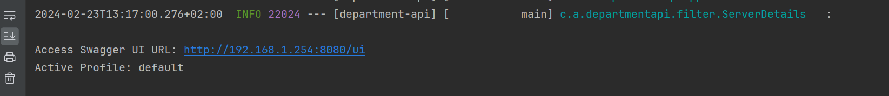
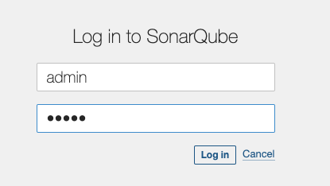
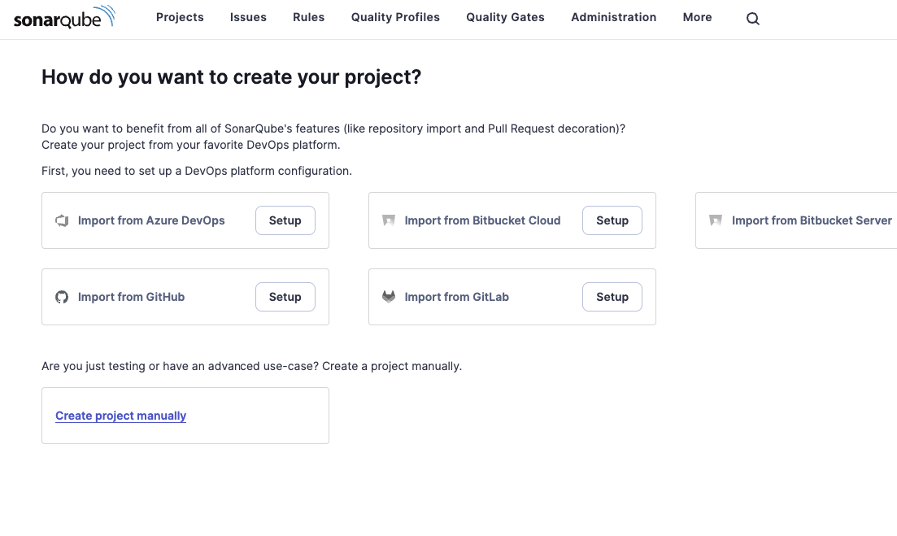
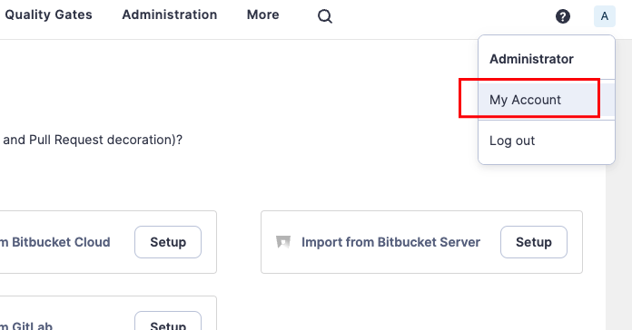
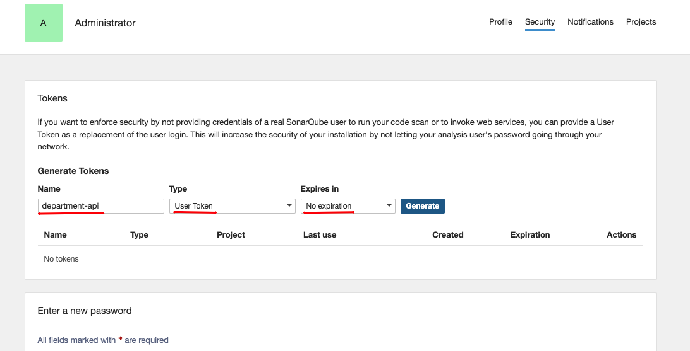
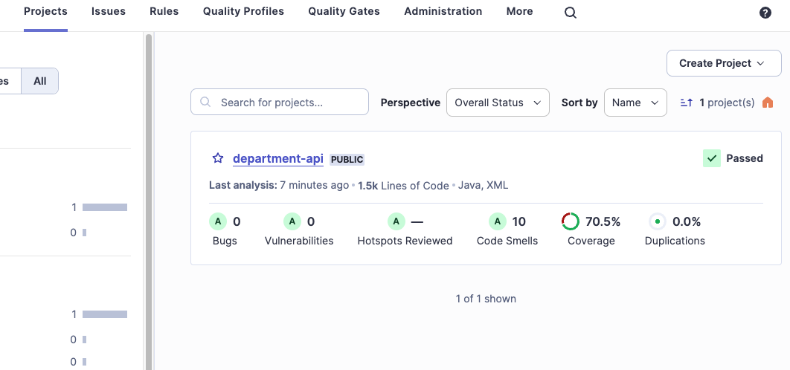

# Department API - Spring Boot 3

A RESTful API created using Spring Boot 3, H2 Database, and JasperReport. The API allows for CRUD operations on 
departments and employees and includes functionality for generating Excel and PDF reports using JasperReport. 
Additionally, the API can send asynchronous emails using Thymeleaf to create the email body, including the ability 
to send attachments. MailHog is integrated as a local SMTP server for testing email functionality. Swagger is also 
integrated for easy API documentation and testing. Database migrations across different environments are managed 
seamlessly with Flyway.


## Table of Contents
- [Run with an In-Memory H2 Database](#run-with-an-in-memory-h2-database)
- [Prerequisites](#prerequisites)
- [Start the Application](#start-the-application)
- [Swagger](#swagger)
- [MailHog](#mailhog)
- [Testing](#testing)
  - [Unit Testing](#unit-testing)
  - [Integration Testing with Testcontainers](#integration-testing-with-testcontainers)
- [SonarQube](#sonarqube)


## Run with an In-Memory H2 Database
If you want to run the application with an **in-memory H2 database**, use the `h2-database` branch. This branch includes 
the necessary configuration files and dependencies to set up and use H2 as the database for the application. 
The migrations specific to H2 can be found under `db/migration/h2`. To get started, simply switch to the 
`h2-database branch` and run the application. Note that all data and related information will be persisted to a 
file on the local file system.


## Prerequisites
Make sure you have installed all the following prerequisites on your development machine:

* **Java 17** - You will need at least Java 17 installed on your machine because it is required by **Spring Boot 3**.
  If you are using IntelliJ, you can easily download it directly from the IDE.
  `File -> Project Structure -> Project -> SDK -> Add SDK -> Download JDK...`. Alternatively, you can download it from
  here: [Download & Install Java 17](https://www.oracle.com/java/technologies/downloads/#java17)


* **Docker Desktop** - `Integration tests use Testcontainers`, which requires Docker Desktop to be installed and running 
on your local machine. Docker Desktop provides the necessary environment to spin up containers for the tests. 
Additionally, MailHog, a local SMTP server, is integrated into the application for testing email functionality. <br><br>
**NOTE**: Make sure Docker Desktop is installed and running before running the integration tests and testing
the email functionality. To use MailHog and start the spring boot application without getting an error, it is **crucial** to start the MailHog Docker container by running the 
following command in the terminal:

```shell
docker run --rm -p 1025:1025 -p 8025:8025 --name mailhog mailhog/mailhog
```


* **Jaspersoft Studio (Optional)** - [Download Jaspersoft Studio community edition](https://community.jaspersoft.com/project/jaspersoft-studio/releases)
  Jaspersoft studio was used to create template files (.jrxml). These template files along with the jasper dependency was
  used by Java to create excel and pdf reports. This application is optional because you will need it only if you want to
  view or modify the template files.


### Database Migrations with Flyway

Before starting the application or running tests, ensure Flyway migrations are executed. Flyway manages database schema changes, ensuring consistency:

- **H2 Migrations**: Used for the main application in the `h2-database` branch. Located under `db/migration/h2`.
- **PostgreSQL Migrations**: For integration tests running against a PostgreSQL environment powered by Testcontainers. Located under `db/migration/postgresql`.


## Start the application
```shell
./mvnw spring-boot:run
```

## Swagger
Swagger was set on the root path, and you can access it on this URL: http://localhost:8080/ui <br>
Additionally, you can find in the logs the swagger UI URL and the active profile.



The API also allows for `generating various reports` using `JasperReport`, such as generating an Excel file, generating 
a PDF file, generating a zipped folder that contains reports, and generating a single Excel file that contains multiple 
sheets inside.


<br>

## MailHog
MailHog is a local SMTP server that captures and displays email messages sent by your application during testing.
To use MailHog, follow these steps:

Start the MailHog Docker container (if it is not running) by running the following command in the terminal:
```shell
docker run --rm -p 1025:1025 -p 8025:8025 --name mailhog mailhog/mailhog
```

Access the MailHog web UI by opening the following URL in your browser: http://localhost:8025/


The MailHog UI allows you to view and inspect the emails sent by your application during testing.

This is an example email received by the application:


<br>

This is the email body, which contains the content of the email message:


<br>

These are the attached files that were sent by the application via email. 
You can see the names and sizes of the attachments:


**NOTE**: The above images are for demonstration purposes only and show how the email will look when you test the 
functionality locally. 

### Stop the MailHog Docker Container
To stop the MailHog Docker container, you can run the following command in the terminal:

```shell
docker stop mailhog
```

<br>

If you want to avoid using MailHog, you can also use MailTrap or your actual email provider. I just used MailHog so 
that you can test the email functionality without having to modify or create an account online. 

You will have to modify the `application.yaml` file if you want to change the smtp configuration.


<br>

Additionally, to demonstrate successful image loading in an email, here is an image from MailTrap UI


As you can see in the MailTrap UI, the image inside the email signature is loading correctly.


## Testing

This application includes unit testing and integration testing using JUnit 5, Mockito, and Spring's `WebMvcTest`. 
The tests are written in a BDD (`Behavior-Driven Development`) style.


### Unit Testing

Unit tests are written using JUnit 5 and Mockito in a `BDD style`, focusing on describing the behavior of individual units of code.

To run the unit tests, use the following command:
```shell
./mvnw test
```


### Integration Testing with Testcontainers
`Integration tests` are performed `using Testcontainers`, a powerful Java library that provides lightweight, disposable 
containers for integration testing. Testcontainers allows spinning up containers for dependencies such as the 
`Postgres database`, providing an isolated and reproducible environment for integration testing.

To run the integration tests, follow these steps:
1. Make sure Docker Desktop is installed and running on your local machine.
2. Execute the following command:

```shell
./mvnw verify -Pintegration-tests
```


**Note**: Integration tests using Testcontainers require Docker Desktop to be installed and running before running the tests.

By running the unit tests and integration tests separately, you can ensure the correctness and reliability of your 
application's components in isolation as well as their interactions in a controlled environment.


## SonarQube
[SonarQube](https://www.sonarqube.org/) is a powerful tool for continuous inspection of code quality. It performs automatic 
reviews with static analysis of code to detect bugs, code smells, and security vulnerabilities.


### Start SonarQube and PostgreSQL Containers

Run the following command to start the SonarQube and PostgreSQL containers:

```shell
docker compose up -d
```

### Access SonarQube UI

Once the containers are up and running, you can access the SonarQube UI by opening the following URL in your web browser:

[http://localhost:9000](http://localhost:9000)


### Generate a SonarQube Token

To analyze your project using SonarQube, you need to generate an access token. Here's how:

1. Log in to the SonarQube UI using the **default credentials**. Note: you will be asked to provide a new password.
   1. login = admin
   2. password = admin <br>
 <br><br>

2. As soon as you log in, you will see this page
 <br><br>

3. The next step is to `generate a token`
   1. Navigate to `My Account` page <br>
       <br><br>
   2. Select the `Security` tab
   3. Provide a `name` for the token, select as a type `User Token`, set `No expiration` and press the `Generate` button
       <br><br>

   4. Copy the generated token to a text editor
   

### Analyze the Project

Now that SonarQube is set up, and you have a token, you can analyze your project with SonarQube. 
Use the following command, replacing `YOUR_SONARQUBE_TOKEN` with the token generated earlier.

```
mvn clean install && mvn sonar:sonar -Dsonar.token=YOUR_SONARQUBE_TOKEN
```

This command will run a SonarQube analysis on the project and send the results to the SonarQube server.

If you refresh the page in the browser, you will see the newly added project.
 <br><br><br>


#### NOTE: Inside the `pom.xml` file, I have excluded some packages from the analysis.
```xml
<sonar.exclusions>
    **/dto/**,
    **/entity/**,
    **/exception/**
</sonar.exclusions>
```
