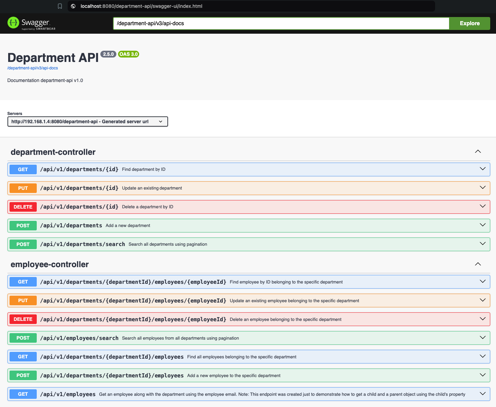
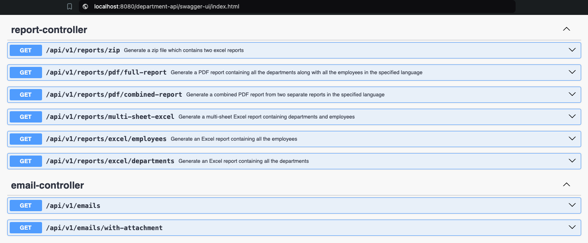

# Department API - Spring Boot 3

A RESTful API created using Spring Boot 3, H2 Database, and JasperReport. The API allows for CRUD operations on
departments and employees and includes functionality for generating Excel and PDF reports using JasperReport.
Additionally, the API can send asynchronous emails using Thymeleaf to create the email body, including the ability
to send attachments. MailHog is integrated as a local SMTP server for testing email functionality. Swagger is also
integrated for easy API documentation and testing.


## Table of Contents
- [Run with an In-Memory H2 Database](#run-with-an-in-memory-h2-database)
- [Prerequisites](#prerequisites)
- [Start the Application](#start-the-application)
- [Start App as a Docker container](#start-app-as-a-docker-container)
- [Swagger](#swagger)
- [MailHog](#mailhog)
- [Testing](#testing)
  - [Unit Testing](#unit-testing)
  - [Integration Testing with Testcontainers](#integration-testing-with-testcontainers)


## Run with an In-Memory H2 Database
If you want to run the application with an **in-memory H2 database**, use the `h2-database` branch.
This branch includes the necessary configuration files and dependencies to set up and use H2 as the database for the application.
To get started, simply switch to the `h2-database branch` and run the application, but all data and related information
will be persisted to a file on the local file system.


## Prerequisites
Make sure you have installed all the following prerequisites on your development machine:

* **Java 17** - You will need at least Java 17 installed on your machine because it is required by **Spring Boot 3**.
  If you are using IntelliJ, you can easily download it directly from the IDE.
  `File -> Project Structure -> Project -> SDK -> Add SDK -> Download JDK...`. Alternatively, you can download it from
  here: [Download & Install Java 17](https://www.oracle.com/java/technologies/downloads/#java17)


* **Docker Desktop** - `Integration tests use Testcontainers`, which requires Docker Desktop to be installed and running
  on your local machine. Docker Desktop provides the necessary environment to spin up containers for the tests.
  Additionally, MailHog, a local SMTP server, is integrated into the application for testing email functionality. <br><br>
  **NOTE**: Make sure Docker Desktop is installed and running before running the integration tests and testing
  the email functionality. To use MailHog and start the spring boot application without getting an error, it is **crucial** to start the MailHog Docker container by running the
  following command in the terminal:

```shell
docker run --rm -p 1025:1025 -p 8025:8025 --name mailhog mailhog/mailhog
```


* **Jaspersoft Studio (Optional)** - [Download Jaspersoft Studio community edition](https://community.jaspersoft.com/project/jaspersoft-studio/releases)
  Jaspersoft studio was used to create template files (.jrxml). These template files along with the jasper dependency was
  used by Java to create excel and pdf reports. This application is optional because you will need it only if you want to
  view or modify the template files.

## Start Postgres as a Docker container.
Start `Docker Desktop` and then execute the following command to start a docker container which will be running Postgres <br>

```shell
docker run -p 5432:5432 -d --name my-postgres-db -e POSTGRES_PASSWORD=pass -e POSTGRES_DB=mydb postgres
```


## Start the application
```shell
./mvnw spring-boot:run
```


## Start App as a Docker container.
1. First, build the application using the Maven wrapper by running the following command in the terminal:
 ```shell
./mvnw install -DskipTests
```
This command will build the application and generate a jar file located at target/department-api-0.0.1-SNAPSHOT.jar.

2. Make sure you have `Docker Desktop` installed and running on your machine.

3. Start the Docker container by executing the following command:
```shell
docker-compose up --build   
```

iThis command will build the Docker image and start the container. If you want to detach from the terminal and run the
container in the background, you can add the `-d` flag
```shell
docker-compose up --build -d   
```
The application should now be running normally within the Docker container, accessible via the predefined ports.

4. To stop the containers and shut down the application, use the following command:
```shell
 docker-compose stop
```

5. To start the application without rebuilding the Docker images use the following command:
```shell
 docker-compose stop
```

If you want to remove the containers completely, including any associated networks and volumes,
you can run the following command:
```shell
 docker-compose down
```
This will stop and remove the containers, networks, and volumes created by Docker-compose.

**Make sure you have Docker and Docker Compose properly installed and configured before following these steps.**


## Swagger
Swagger was set on the root path, and you can access it on this URL: http://localhost:8080/


The API also allows for `generating various reports` using `JasperReport`, such as generating an Excel file, generating
a PDF file, generating a zipped folder that contains reports, and generating a single Excel file that contains multiple
sheets inside.





<br>

## MailHog
MailHog is a local SMTP server that captures and displays email messages sent by your application during testing.
To use MailHog, follow these steps:

Start the MailHog Docker container (if it is not running) by running the following command in the terminal:
```shell
docker run --rm -p 1025:1025 -p 8025:8025 --name mailhog mailhog/mailhog
```

Access the MailHog web UI by opening the following URL in your browser: http://localhost:8025/


The MailHog UI allows you to view and inspect the emails sent by your application during testing.

This is an example email received by the application:


<br>

This is the email body, which contains the content of the email message:


<br>

These are the attached files that were sent by the application via email.
You can see the names and sizes of the attachments:


**NOTE**: The above images are for demonstration purposes only and show how the email will look when you test the
functionality locally.

### Stop the MailHog Docker Container
To stop the MailHog Docker container, you can run the following command in the terminal:

```shell
docker stop mailhog
```

<br>

If you want to avoid using MailHog, you can also use MailTrap or your actual email provider. I just used MailHog so
that you can test the email functionality without having to modify or create an account online.

You will have to modify the `application.yaml` file if you want to change the smtp configuration.


<br>

Additionally, to demonstrate successful image loading in an email, here is an image from MailTrap UI


As you can see in the MailTrap UI, the image inside the email signature is loading correctly.


## Testing

This application includes unit testing and integration testing using JUnit 5, Mockito, and Spring's `WebMvcTest`.
The tests are written in a BDD (`Behavior-Driven Development`) style.


### Unit Testing

Unit tests are written using JUnit 5 and Mockito in a `BDD style`, focusing on describing the behavior of
individual units of code.

To run the unit tests, use the following command:
```shell
./mvnw test
```


### Integration Testing with Testcontainers
`Integration tests` are performed `using Testcontainers`, a powerful Java library that provides lightweight, disposable
containers for integration testing. Testcontainers allows spinning up containers for dependencies such as the
`Postgres database`, providing an isolated and reproducible environment for integration testing.

To run the integration tests, follow these steps:
1. Make sure Docker Desktop is installed and running on your local machine.
2. Execute the following command:

```shell
./mvnw verify -Pintegration-tests
```


**Note**: Integration tests using Testcontainers require Docker Desktop to be installed and running before running the tests.

By running the unit tests and integration tests separately, you can ensure the correctness and reliability of your
application's components in isolation as well as their interactions in a controlled environment.